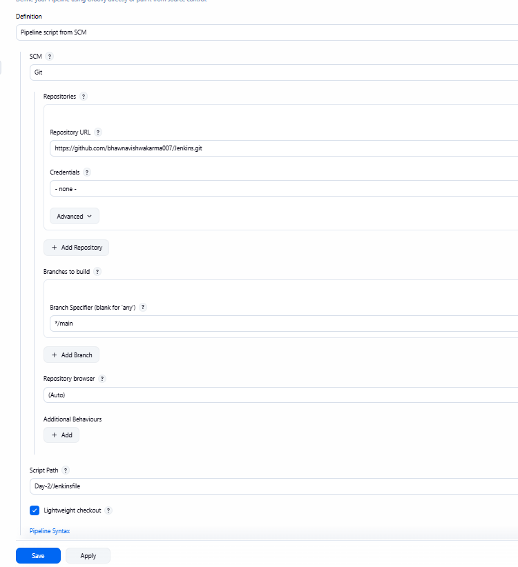

# Jenkins SCM Method Configuration Steps

## Overview
SCM (Source Code Management) method allows Jenkins to fetch pipeline scripts directly from a Git repository instead of manually entering the pipeline script in Jenkins UI.

---

## Configuration Screenshot

*The above screenshot shows the actual Jenkins UI for configuring "Pipeline script from SCM" method with Script Path: `Day-2/Jenkinsfile`.*

---

## Step-by-Step Configuration

### Step 1: Create or Configure a Pipeline Job
1. Navigate to Jenkins Dashboard
2. Click **"New Item"** or select an existing pipeline job
3. Enter a job name (e.g., "Terraform-Pipeline")
4. Select **"Pipeline"** as the job type
5. Click **"OK"**

---

### Step 2: Configure Pipeline Definition
1. Scroll down to the **"Pipeline"** section
2. Under **"Definition"**, select **"Pipeline script from SCM"** from the dropdown
   - This tells Jenkins to fetch the Jenkinsfile from your repository
   - ✅ **As shown in the screenshot above**

---

### Step 3: Select SCM System
1. In the **"SCM"** dropdown, select **"Git"**
   - This indicates you're using Git as your source code management system
   - ✅ **As shown in the screenshot above**

---

### Step 4: Configure Git Repository

#### 4.1 Repository URL
- **Repository URL:** Enter your Git repository URL
  - Example from screenshot: `https://github.com/bhawnavishwakarma007/Jenkins.git`
  - Or SSH format: `git@github.com:username/repository.git`
  - ✅ **Field visible in the screenshot**

#### 4.2 Credentials (if needed)
- **Credentials:** Select credentials from the dropdown if:
  - Repository is private
  - Authentication is required
- If public repository: Select **"- none -"** (as shown in screenshot)
- To add credentials:
  1. Click the dropdown arrow next to "Credentials"
  2. Click **"Add"** or **"Jenkins"**
  3. Select credential type (Username with password, SSH Username with private key, etc.)
  4. Enter credentials and click **"Add"**

---

### Step 5: Configure Branch Specification

- **Branch Specifier (blank for 'any'):** Enter the branch name
  - Example from screenshot: `*/main` (for main branch)
  - Other examples:
    - `*/develop` (for develop branch)
    - `*/feature/*` (for all feature branches)
    - Leave blank to build any branch
  - ✅ **Field shows `*/main` in screenshot**

---

### Step 6: Specify Script Path
- **Script Path:** Enter the path to your Jenkinsfile
  - This is relative to the repository root
  - **Use:** `Day-2/Jenkinsfile` ✅ **As shown in screenshot**
  - This Jenkinsfile includes:
    - Choice parameter for Terraform action (apply/destroy)
    - Terraform init, plan, and apply/destroy stages
    - Works with Terraform files in `Day-2/Day-1` directory
  - ✅ **Field shows `Day-2/Jenkinsfile` in screenshot**

---

### Step 7: Save Configuration
1. Click **"Save"** to save and exit
   - Or click **"Apply"** to save without leaving the page
2. Jenkins will validate the configuration
   - ✅ **Both buttons visible at bottom of screenshot**

---

## Complete Configuration Example (Based on Screenshot)
